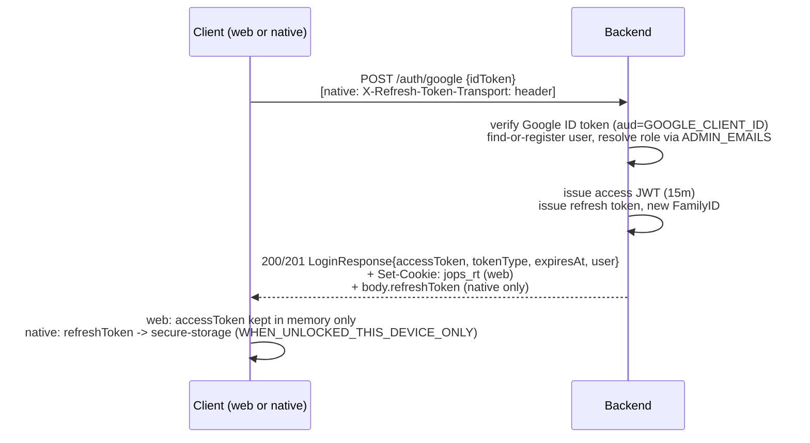
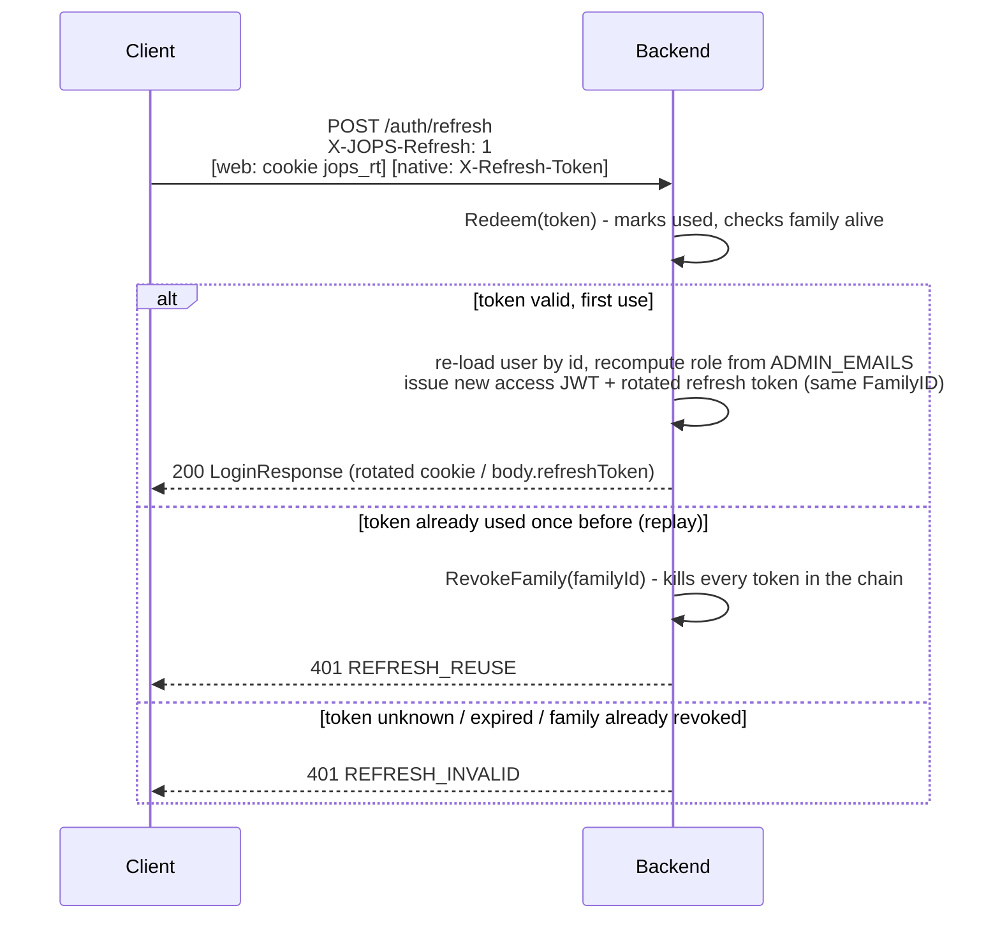
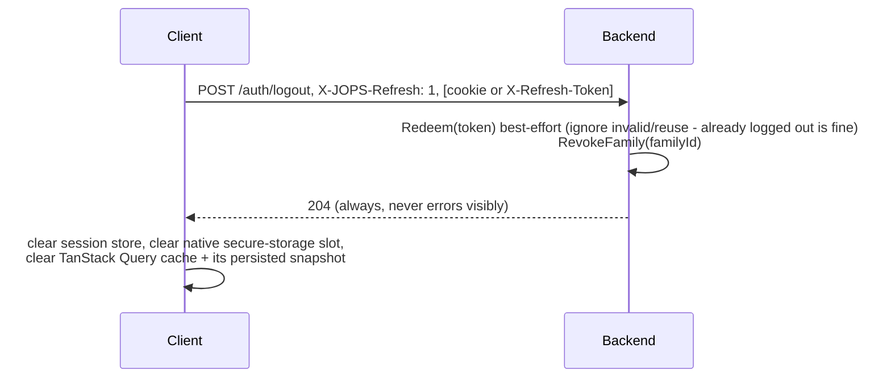

# Session token storage rework (2026-09-05)

> [!success] Status: **DONE, shipped, committed on `develop`**
> Closes accepted risk #2 *and* #3 from [[auth-hardening-2026-09-02]] ("session in `localStorage`
> on web" / "no refresh tokens"). This was carried as an **accepted risk**, not an open TODO, so
> there is no separate checklist item elsewhere in the vault to strike through — the "done" marker
> lives here and on the two risk lines in [[auth-hardening-2026-09-02]], [[ADR]] and
> [[backend-contract]], all updated the same day. Nothing about session-token storage is pending.
>
> Seven commits on `develop`, no other work mixed in:
> `f179265` refresh-token store (domain+infra) → `605fe48` auth service/endpoints/cookies/CSRF/config
> → `71ac11c` swagger regen → `9cbd9d7` frontend contracts regen → `e1b13ee` compose/env wiring →
> `509a435` frontend session/refresh core → `947ab21` frontend stream/profile/query-cache fallout.

Owner explicitly asked for the most secure storage available per platform. Chose the full design
(memory-only access token + HttpOnly rotating refresh cookie with reuse detection), not the cheaper
"just move the 24h JWT into a cookie" option, after two independent implementation plans were drafted
and weighed live — see [[#Why the full design, not just "24h JWT in a cookie"]] below.

## The shape

| | web (PWA) | native (iOS/Android) |
|---|---|---|
| access token (JWT, **15m**, was 24h) | **JS memory only** — zustand, never persisted anywhere | same |
| refresh token (opaque, 30d, rotates every use) | `HttpOnly; Secure; SameSite=Strict; Path=/api/v1/auth` cookie (`jops_rt`) | `expo-secure-store`, `keychainAccessible: WHEN_UNLOCKED_THIS_DEVICE_ONLY`, sent as `X-Refresh-Token` header |
| `RequireAuth` (every route except `/auth/*`) | `Authorization: Bearer` **only** — no cookie fallback, ever | same |
| logout | `POST /auth/logout` redeems + revokes the whole refresh-token family server-side | same |

> [!info] `RequireAuth` never grew a cookie fallback, deliberately
> Because the access token is still Bearer-only everywhere else, the API's CSRF surface stays
> exactly where it was before this change: **zero**. Only `/auth/refresh`/`/auth/logout` are
> cookie-authenticated, and those two get their own defense (below). `authenticateStream` (SSE/WS
> ticket redemption) was likewise left untouched — it must keep ignoring the refresh cookie, or
> cross-site WebSocket hijacking comes back (the whole stream-ticket mechanism in
> [[stream-connection-tickets-2026-09-03]] exists precisely to avoid relying on cookie
> same-origin behavior for streams).

## Reference: the three flows, exactly as implemented

### Login — `POST /api/v1/auth/google`

`accessToken`/`tokenType`/`expiresAt`/`user` are **always** in the body, on both platforms — only
the refresh token's transport differs. The access token was never persisted client-side by design,
on either platform, so returning it in the body is fine everywhere.

### Silent refresh — `POST /api/v1/auth/refresh`

Triggered on app boot (`hydrate()`) and on any `401` from a normal API call (via the axios response
interceptor), single-flight so N parallel triggers cost exactly one network round-trip.

This is where the actual security win lives: **the user is re-loaded from the database on every
refresh**, and their role is recomputed from `ADMIN_EMAILS` fresh each time — never trusted from
the old token. A demoted admin, or a deleted account, is caught within one access-token TTL (15
minutes), not up to 24 hours later as before.

Missing/wrong `X-JOPS-Refresh` header, or a form-like `Content-Type`, → `403` before any of the
above even runs (CSRF defense, see below).

### Logout — `POST /api/v1/auth/logout`

First **real** server-side logout this app has had. Before this, "logout" only ever forgot the
token client-side — the stateless JWT (`jwt_issuer.go`, no `jti`, no denylist) stayed valid until
its own `exp` regardless. That specific gap is unchanged for the *access* token itself — see
[[#What this still doesn't fix]] — but the refresh token, which is what actually re-authorizes
future access, is now truly dead the instant logout completes.

## Reference: every moving part, where it lives

| Concept | File(s) |
|---|---|
| Refresh-token port | `apps/backend/internal/domain/ports/refresh_token.go` (`IRefreshTokenStore`: `Issue`/`Redeem`/`RevokeFamily`) |
| Sentinel errors | `apps/backend/internal/domain/ports/errors.go` (`ErrRefreshInvalid`, `ErrRefreshReuse`), mapped to `REFRESH_INVALID`/`REFRESH_REUSE` (401) in `apierr/codes.go` + `endpoints/error_codes.go` |
| In-memory store | `apps/backend/internal/infrastructure/refreshtoken/memory.go` + `reaper.go` |
| Redis store | `apps/backend/internal/infrastructure/refreshtoken/redis/store.go` (Lua check-and-set burn script) |
| Cookie set/clear | `apps/backend/internal/infrastructure/api/endpoints/cookies.go` (`setRefreshCookie`/`clearRefreshCookie`, byte-identical attributes on both) |
| CSRF middleware | `apps/backend/internal/infrastructure/api/endpoints/csrf.go` (`requireCSRFHeader`) |
| Auth service | `apps/backend/internal/application/services/auth_service.go` (`LoginWithGoogle`/`Refresh`/`Logout`) |
| Auth endpoints | `apps/backend/internal/infrastructure/api/endpoints/auth_endpoints.go` (`/google`, `/refresh`, `/logout`) |
| Config | `apps/backend/internal/config/config.go` — see table below |
| Store selection (Redis vs memory) | `apps/backend/cmd/app/main.go`, same branch pattern as the stream-ticket store |
| Frontend session store | `apps/frontend/src/shared/stores/session.store.ts` — `Session = {accessToken, user}`, in memory only |
| Frontend refresh (single-flight) | `apps/frontend/src/shared/api/refresh.ts` |
| Frontend interceptor | `apps/frontend/src/shared/api/interceptors.ts` — 401 → refresh-and-retry once (`__retried` guard) |
| Native refresh-token storage | `apps/frontend/src/shared/lib/secure-storage.ts` — **native-only now**, web branch throws |
| Query-cache purge on logout | `apps/frontend/src/providers/query-client.ts`, `apps/frontend/src/shared/stores/query-cache-purge.ts` |

## Reference: config

| Var | Default | Notes |
|---|---|---|
| `JWT_TTL` | `15m` (was `24h`) | access-token lifetime |
| `REFRESH_TOKEN_TTL` | `720h` (30d) | |
| `REFRESH_TOKEN_REAP_INTERVAL` | `1h` | memory store only — Redis expires its own keys |
| `AUTH_COOKIE_NAME` | `jops_rt` | |
| `AUTH_COOKIE_PATH` | `/api/v1/auth` | scopes the cookie away from every non-auth route |
| `AUTH_COOKIE_SECURE` | `true` | dev compose overrides to `false` (plain HTTP) |
| `AUTH_COOKIE_SAMESITE` | `strict` | `strict\|lax\|none`; **boot fails** if `none` + `AUTH_COOKIE_SECURE=false` |
| `RATE_LIMIT_REFRESH_PER_IP` | `30` | IP-keyed — `/auth/refresh` sits outside `RequireAuth`, no user id to key on |
| `CORS_ALLOW_CREDENTIALS` | `false` (repo default) | now `true` in both `docker-compose.yml` (dev) and `docker-compose.prod.yml` |

## Why `SameSite=Strict` works in local dev too

`localhost:3000` (frontend) and `localhost:8080` (backend) are different **origins** but the same
**site** — a cookie's "site" is scheme + registrable domain, and **ports are not part of it**. So
`SameSite=Strict` flows between them exactly as it does in same-origin prod
(`jojo-one-piece-simulator.duckdns.org`, NPM routing `/` → frontend, `/api` → backend). No
`SameSite=None`, no dev-only `/api` proxy, no relaxation of any kind between dev and prod — the only
dev-specific config is `CORS_ALLOW_CREDENTIALS=true` and `AUTH_COOKIE_SECURE=false` (dev is plain
HTTP; a `Secure` cookie over `http://localhost` is accepted by Chrome/Firefox but the behavior has
varied historically, so this stays an explicit env var rather than something inferred from the
request).

## CSRF — three independent layers, no double-submit token

Only `/auth/refresh` and `/auth/logout` are cookie-authenticated, so only they need this:

1. `SameSite=Strict` (primary, and free in dev — see above).
2. Required header `X-JOPS-Refresh: 1` — unforgeable cross-site without a CORS preflight that fails
   against the origin allowlist.
3. Reject `application/x-www-form-urlencoded`/`multipart/form-data` — the only content-types a
   preflight-free cross-site POST can carry.

Every other route needs nothing new: a Bearer-only `RequireAuth` was never CSRF-vulnerable to begin
with (a cross-site page cannot set a custom header without JS, and JS reading a token to set it is
exactly what a memory-only access token prevents).

## Refresh-token store internals — how it differs from stream tickets

Modelled directly on `ports.IStreamTicketStore` ([[stream-connection-tickets-2026-09-03]]) — same
memory/Redis split, same reaper, same `SET NX PX` + Lua-script-burn pattern. Two differences:

- **Redeem doesn't delete on read.** A stream ticket's single-use check is "delete first, then
  check expiry"; a refresh token instead marks itself `used` and is kept until natural TTL expiry, so
  a *second* redemption of the same token can be recognized as **reuse** (as opposed to "unknown
  token", which stream tickets never need to distinguish).
- **Family revocation.** Every token minted from one login (and every token minted by rotating it)
  shares a `FamilyID`. A replayed (already-used) token redemption revokes the *entire* family in one
  atomic op (`RevokeFamily` = one `DEL` on the family marker key) — the signal that a token leaked and
  was used twice by two different parties. Logout also calls `RevokeFamily` on purpose.

> [!warning] Without `REDIS_URL`, a backend restart now logs out every user
> The in-memory refresh-token store has no persistence, same as stream tickets. This is a real
> regression from the old stateless-JWT model and contradicts the repo's "everything fails open
> without Redis" norm — `cmd/app/main.go` logs a blunt warning when it falls back to the in-memory
> store. Prod always has Redis; only matters for a `local-up` session that isn't running the redis
> service.

## Frontend — what actually changed

`src/shared/stores/session.store.ts`'s `Session` dropped `expiresAt` (written 3×, read 0× in the old
code) and now holds just `{accessToken, user}` in memory. `hydrate()` purges the legacy
`jops.session` localStorage key unconditionally (one-shot migration — every existing user gets
logged out exactly once, by design; there's no way to trade an old 24h JWT for a refresh token
without building a one-shot exchange endpoint that would itself be an auth bypass) then calls the
new single-flight `refreshSession()` (`src/shared/api/refresh.ts`) to silently re-establish a
session on boot. The axios response interceptor's 401 handler now does one refresh-and-retry before
falling back to `clearSession()` — bounded by a `__retried` flag so a refresh failure never loops.

`src/shared/lib/secure-storage.ts` is native-only now — the web branch throws instead of silently
writing to `localStorage`, so a future accidental web caller fails loudly. `app/login.tsx` gained a
`!isHydrated → LoadingScreen` guard to fix a login-flash that the network-based hydrate introduced
(a returning user would otherwise see the login screen for ~50-100ms before the silent refresh
resolved).

The two out-of-React token readers (`picture-events-bridge.tsx`'s SSE, `game-socket.store.ts`'s WS)
needed no functional change — both mint their stream tickets through the interceptor-bearing
`apiClient`, so they inherit refresh-and-retry for free, and neither ever read the now-removed
`expiresAt`. Logout additionally clears the persisted TanStack Query cache (new
`src/shared/stores/query-cache-purge.ts` indirection, to avoid `session.store.ts` pulling in
`@tanstack/react-query`'s full dependency graph into test files that never mount `<QueryProvider>`)
— moving the token out of `localStorage` while leaving another user's profile/lobby data behind in
the persisted query cache would have been incomplete.

## What this still doesn't fix

> [!warning] Known remaining gaps — read before "fixing" any of these without checking here first
> - **No revocation of the access token itself.** `jwt_issuer.go`'s `Parse` is still fully stateless
>   (no `jti`, no denylist) — a stolen access token is valid until its own 15-minute `exp` regardless
>   of logout. Bounded to 15 minutes now instead of 24 hours, which is the whole point, but not zero.
> - **No CSP header** (`deployments/docker/nginx.frontend.conf` sets only COOP today). A memory-only
>   access token stops *exfiltration* (nothing durable to steal), not *in-page abuse* — a same-origin
>   XSS can still act as the logged-in user for as long as the page stays open. Flagged as a separate,
>   future tanda — needs real testing against Expo's web bundle (`'wasm-unsafe-eval'`, inline styles).
> - **NPM's proxy config is not in this repo** (GUI-managed on the server). Confirm the `/api`
>   location passes `Set-Cookie`/`Cookie` through before trusting this in prod — it's the one hop
>   nothing here can verify from source.

## Why the full design, not just "24h JWT in a cookie"

> [!tip] Two implementation plans were drafted and compared live before choosing
> The cheap alternative (leave the JWT's shape/TTL alone, just move it into an `HttpOnly` cookie,
> `RequireAuth` accepts Bearer-or-cookie) is roughly a fifth of the work and gets "nothing in
> `localStorage`" — but it (a) still has zero revocation, since the JWT itself is unchanged and
> stays valid until `exp` regardless of "logout", and (b) makes cookie auth valid on *every* route,
> handing the whole API a CSRF surface it doesn't have today, which then needs its own defense. The
> owner chose the full design specifically for real revocation and to keep `RequireAuth` Bearer-only
> (zero new CSRF surface) — reuse-detection *was* kept in the shipped version, unlike a leaner
> "burn-on-use only" variant that was also considered during planning and rejected in favor of full
> family revocation.

## Live-testing implication

The two-tab `localStorage`-swap trick documented in
[[game-round-result-live-walkthrough-2026-09-02]] is dead — one browser profile is one cookie jar,
so tab B's login now overwrites tab A's live session outright (no stale in-memory copy to exploit).
Replaced by **two separate browser profiles / incognito windows** — fully isolated cookie jars and JS
heaps, costs one extra Google sign-in per test session. See that note's updated Setup section.

Related: [[auth-hardening-2026-09-02]], [[backend-contract]], [[frontend-stack]],
[[stream-connection-tickets-2026-09-03]], [[game-realtime-transport]], [[picture-events-sse]],
[[ADR]].
